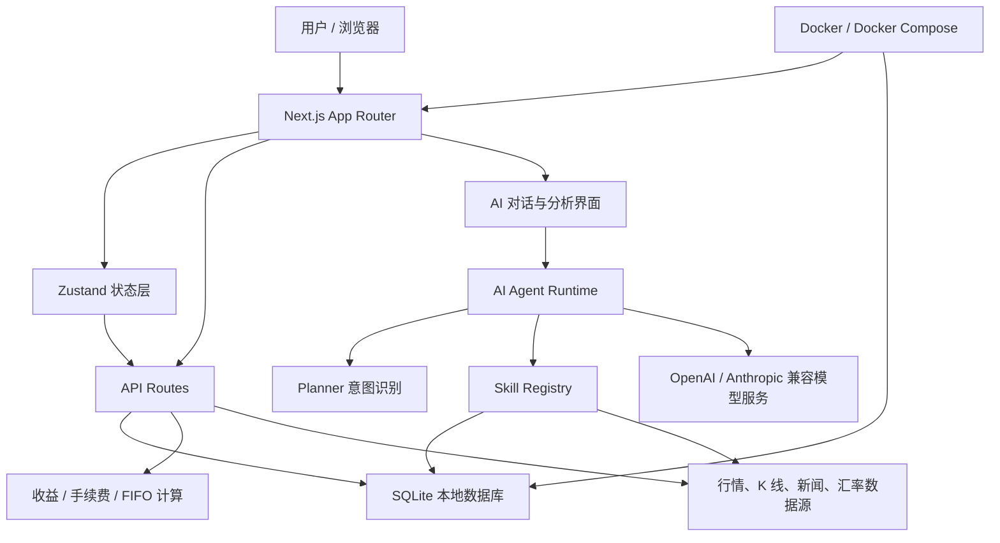

# StockTracker

[English](./README_en.md) | 中文

StockTracker 是一个本地优先的个人投资记录、组合分析和 AI 投研助手。📈

它不是又一个需要账号、云同步和订阅制后台的投资工具。StockTracker 的核心目标更朴素，也更硬核：把你的交易记录、持仓成本、收益归因、行情数据和 AI 分析留在你自己的机器上，让个人投资者拥有一套可解释、可扩展、可审计的本地投资工作台。

## 为什么做它 💡

很多投资工具擅长展示价格，却不擅长回答这些真正贴近个人决策的问题：

- 我这只股票真实成本是多少？
- 分红、手续费、卖出批次之后，收益到底怎么算？
- 当前组合最大的风险来自哪里？
- 哪些持仓正在拖累收益，哪些持仓值得继续观察？
- 我能不能让 AI 基于自己的真实交易记录，而不是泛泛而谈地分析？

StockTracker 希望把这些能力收在一个开源项目里：记录足够认真，计算足够透明，AI 足够克制，数据默认属于你自己。

## 核心能力 ✨

- 本地 SQLite 持久化，默认不依赖云端账号。
- 支持 A 股（含 ETF）、港股、美股、基金、加密资产的统一记录模型。
- 支持买入、卖出、分红交易记录。
- 基于 FIFO 计算已实现收益、剩余持仓成本和总盈亏。
- 按市场自动计算手续费，支持用户配置费率。
- 聚合腾讯财经、Nasdaq、Yahoo Finance、Stooq、Alpha Vantage 等行情数据源。
- 支持 K 线、技术指标、估值字段、新闻和大盘概览。
- 内置 AI 对话、组合分析、个股分析和大盘分析，支持中英文分析语言切换。
- AI Agent Runtime 按需调用 Skill，内置上下文 Token 预算管理，避免把全部持仓粗暴塞进上下文。
- 支持 Markdown 格式的内置 Skill 描述，为后续插件化扩展预留结构。
- 多数据源自动降级，兜底 Manual 手动输入模式。
- 内置汇率服务，支持多币种持仓的统一换算。
- 提供 AI Agent 调试视图，方便排查意图识别和 Skill 调用链路。
- 提供外部数据接口 smoke test，方便开源维护时及时发现上游接口变化。

## 整体架构 🧭



## AI Agent 🤖

StockTracker 的 AI 不是通用聊天机器人，而是围绕个人持仓和股票数据工作的投研 Agent。

当前 Agent 采用极简但清晰的链路：

```text
用户问题
  -> Planner 识别意图和标的
  -> Skill Registry 选择需要的数据能力
  -> Executor 读取本地持仓、行情、新闻、技术指标或公开搜索来源
  -> Context Composer 组装最小必要上下文
  -> LLM 流式生成回复
```

这套设计的重点不是炫技，而是降低上下文浪费，让 AI 只拿它需要的数据。对于持仓很多的用户，这一点尤其重要。

当用户询问个股新闻、公告、利好利空，或 A 股大盘今日政策、盘面新闻时，Agent 会按需调用公开网页搜索；搜索结果会作为带标题、链接、摘要和搜索时间的候选来源进入回答上下文。

## 本地优先与隐私边界 🔒

StockTracker 默认把交易和配置数据保存在本机 SQLite 文件中：

```text
data/finance.sqlite
```

项目当前不提供云端账号体系，不默认上传你的交易记录。AI API Key 推荐放在 `.env.local`，服务端读取，不写入 JSON 备份。

需要注意：

- 如果你更换机器，数据不会自动同步。
- 如果你删除本地数据库，项目无法从云端恢复。
- 建议定期使用 JSON 导出功能进行备份。
- AI 分析会把必要的持仓上下文发送给你配置的模型服务商。

## 快速开始 🚀

环境要求：

- Node.js 18+
- pnpm
- macOS / Linux / Windows

```bash
git clone https://github.com/byte92/finance_sys.git
cd finance_sys
pnpm install
pnpm dev
```

启动后访问：

- [http://localhost:3218](http://localhost:3218)

更多开发、环境变量、数据库和测试说明见 [开发指南](./docs/DEVELOPMENT.md)。

## Docker 运行 🐳

如果你只想把它作为本地服务跑起来，可以直接使用 Docker Compose：

```bash
git clone https://github.com/byte92/finance_sys.git
cd finance_sys
cd docker
docker compose up -d --build
```

启动后访问：

- [http://localhost:3218](http://localhost:3218)

如需修改 Docker 暴露端口，可把 `docker/.env.example` 复制为 `docker/.env` 并修改 `HOST_PORT`。如需启用 AI 功能，可把根目录 `.env.example` 复制为 `.env.local` 并填入模型配置；Docker Compose 会把 `.env.local` 可选注入容器。没有 `docker/.env` 时端口默认使用 `3218`。容器默认把 SQLite 数据保存在 Docker volume 中，重启不会丢失。

更多 Docker、数据卷和 Docker Hub 发布说明见 [Docker 部署指南](./docker/README.md)。

## 项目结构

```text
app/          Next.js App Router 页面和 API Route
components/   React 组件和业务 UI
config/       默认配置
docs/         架构、接口和维护文档
hooks/        React hooks
lib/          领域逻辑、数据源、AI/Agent、SQLite
skills/       Agent Skill Markdown 描述
store/        Zustand 状态管理
tests/        单元测试和外部接口 smoke test
types/        共享类型
```

详细边界见 [项目目录结构说明](./docs/PROJECT_STRUCTURE.md)。

## 文档

- [开发指南](./docs/DEVELOPMENT.md)
- [Docker 部署指南](./docker/README.md)
- [项目目录结构](./docs/PROJECT_STRUCTURE.md)
- [数据接口清单](./docs/DATA_API_INVENTORY.md)
- [Agent 架构设计](./docs/AGENT_ARCHITECTURE.md)
- [Skill 标准](./docs/SKILL_STANDARD.md)
- [AI 对话需求](./docs/AI_CHAT_REQUIREMENTS.md)
- [行情获取说明](./docs/PRICE_FETCHING.md)
- [开源发布检查清单](./docs/OPEN_SOURCE_CHECKLIST.md)

## 参与贡献 🛠️

欢迎提交 Issue、改进文档、补充测试、优化 UI、修复行情源、扩展 Skill 或完善 Agent Runtime。

在提交 PR 前请阅读 [CONTRIBUTING.md](./CONTRIBUTING.md)。

常用验证命令：

```bash
pnpm test
pnpm build
```

真实外部接口检查：

```bash
pnpm test:external
```

## 路线方向 🗺️

- 更清晰的 Agent Skill 插件化加载机制。
- 更强的组合风险归因和交易复盘能力。
- 更完整的行情源健康检查与数据源治理。
- 更稳健的 AI 调试、追踪和上下文管理。
- Docker Hub 镜像发布与更顺滑的一键部署体验。
- 更完善的开源协作规范和示例数据。

## 免责声明 ⚠️

StockTracker 提供的是交易记录、数据整理和辅助分析工具，不构成任何投资建议。行情、估值、新闻和 AI 输出可能存在延迟、遗漏或错误。请独立判断风险，并对自己的投资决策负责。

## License

[ISC](./LICENSE)
