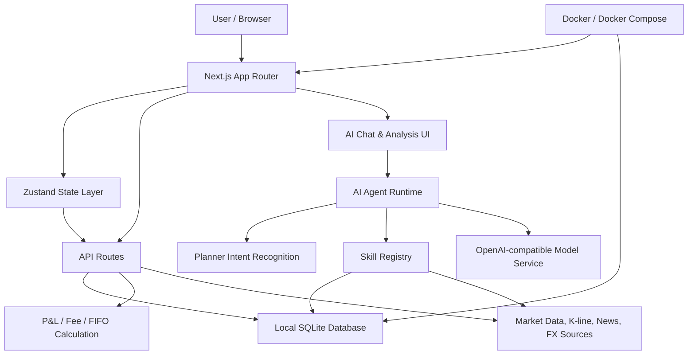

# StockTracker

English | [中文](./README.md)

StockTracker is a local-first personal investment tracker, portfolio analyzer, and AI investing copilot. 📈

It's not another investment tool that requires accounts, cloud sync, and subscription-based backends. StockTracker's goal is simpler and more hard-core: keep your trade records, cost basis, return attribution, market data, and AI analysis on your own machine — giving individual investors an interpretable, extensible, and auditable local investment workstation.

## Why Build It 💡

Many investment tools are good at showing prices, but struggle to answer the questions that truly matter for personal decision-making:

- What is my real cost basis for this stock?
- After dividends, fees, and sold lots, how do I calculate my actual return?
- Where is the biggest risk in my current portfolio?
- Which holdings are dragging returns, and which are worth holding?
- Can I have AI analyze based on my actual trade records instead of generic advice?

StockTracker aims to bring all these capabilities into one open-source project: careful record-keeping, transparent calculations, restrained AI, and data that defaults to staying yours.

## Core Features ✨

- Local SQLite persistence — no cloud account required by default.
- Unified record model for A-shares, HK stocks, US stocks, funds, ETFs, and crypto assets.
- Support for buy, sell, and dividend trade records.
- FIFO-based realized P&L, remaining cost basis, and total gain/loss calculation.
- Automatic fee calculation by market, with user-configurable rate settings.
- Aggregated market data from Tencent Finance, Nasdaq, Yahoo Finance, Stooq, Alpha Vantage, and more.
- K-line charts, technical indicators, valuation fields, news, and market overview.
- Built-in AI chat, portfolio analysis, individual stock analysis, and market analysis.
- AI Agent Runtime calls Skills on demand — avoids stuffing all holdings into context.
- Markdown-based built-in Skill descriptions, laying the groundwork for future plugin extensions.
- External data API smoke tests for catching upstream interface changes during open-source maintenance.

## Architecture 🧭



## AI Agent 🤖

StockTracker's AI is not a generic chatbot — it's an investment research Agent built around your personal holdings and stock data.

The current Agent follows a minimal but clear pipeline:

```text
User question
  -> Planner identifies intent and tickers
  -> Skill Registry selects required data capabilities
  -> Executor reads local holdings, market data, news, technical indicators
  -> Context Composer assembles the minimum necessary context
  -> LLM streams the response
```

The focus of this design is not showing off, but reducing context waste — letting AI fetch only the data it needs. This is especially important for users with many holdings.

## Local-First & Privacy Boundary 🔒

StockTracker saves trade and configuration data in a local SQLite file by default:

```text
data/finance.sqlite
```

The project currently does not provide a cloud account system and does not upload your trade records by default. AI API Keys are recommended to be placed in `.env.local`, read server-side, and excluded from JSON backups.

Things to note:

- Data does not sync automatically when you switch machines.
- If you delete the local database, the project cannot recover it from the cloud.
- Regular JSON export backups are recommended.
- AI analysis will send necessary holding context to your configured model provider.

## Quick Start 🚀

Requirements:

- Node.js 18+
- npm
- macOS / Linux / Windows

```bash
git clone https://github.com/byte92/finance_sys.git
cd finance_sys
npm install
npm run dev
```

After starting, visit:

- [http://localhost:3000](http://localhost:3000)

For more on development, environment variables, database, and testing, see the [Development Guide](./docs/DEVELOPMENT.md).

## Docker 🐳

If you just want to run it as a local service, use Docker Compose directly:

```bash
git clone https://github.com/byte92/finance_sys.git
cd finance_sys
docker compose up -d --build
```

After starting, visit:

- [http://localhost:3000](http://localhost:3000)

For AI features, copy `.env.example` to `.env.local` and fill in your model configuration. The container stores SQLite data in a Docker volume by default, so data persists across restarts.

For more on Docker, volumes, and Docker Hub publishing, see the [Docker Deployment Guide](./docs/DOCKER.md).

## Project Structure

```text
app/          Next.js App Router pages and API Routes
components/   React components and business UI
config/       Default configuration
docs/         Architecture, API, and maintenance documentation
hooks/        React hooks
lib/          Domain logic, data sources, AI/Agent, SQLite
skills/       Agent Skill Markdown descriptions
store/        Zustand state management
tests/        Unit tests and external API smoke tests
types/        Shared types
```

For detailed boundaries, see [Project Structure](./docs/PROJECT_STRUCTURE.md).

## Documentation

- [Development Guide](./docs/DEVELOPMENT.md)
- [Docker Deployment Guide](./docs/DOCKER.md)
- [Project Structure](./docs/PROJECT_STRUCTURE.md)
- [Data API Inventory](./docs/DATA_API_INVENTORY.md)
- [Agent Architecture](./docs/AGENT_ARCHITECTURE.md)
- [Skill Standard](./docs/SKILL_STANDARD.md)
- [AI Chat Requirements](./docs/AI_CHAT_REQUIREMENTS.md)
- [Price Fetching](./docs/PRICE_FETCHING.md)
- [Open Source Checklist](./docs/OPEN_SOURCE_CHECKLIST.md)

## Contributing 🛠️

Issues, documentation improvements, test coverage, UI enhancements, data source fixes, Skill extensions, and Agent Runtime improvements are all welcome.

Please read [CONTRIBUTING.md](./CONTRIBUTING.md) before submitting a PR.

Common verification commands:

```bash
npm test
npm run build
```

Real external API checks:

```bash
npm run test:external
```

## Roadmap 🗺️

- Clearer Agent Skill plugin loading mechanism.
- Stronger portfolio risk attribution and trade review capabilities.
- More complete data source health checks and governance.
- More robust AI debugging, tracing, and context management.
- Docker Hub image publishing and smoother one-click deployment.
- Better open-source collaboration standards and sample data.

## Disclaimer ⚠️

StockTracker provides trade recording, data organization, and analysis assistance tools. It does not constitute investment advice. Market data, valuations, news, and AI output may contain delays, omissions, or errors. Please make independent risk judgments and take responsibility for your own investment decisions.

## License

[ISC](./LICENSE)
