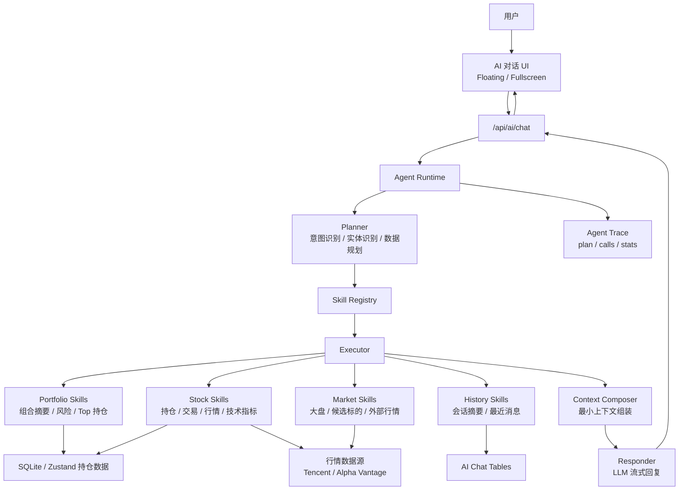
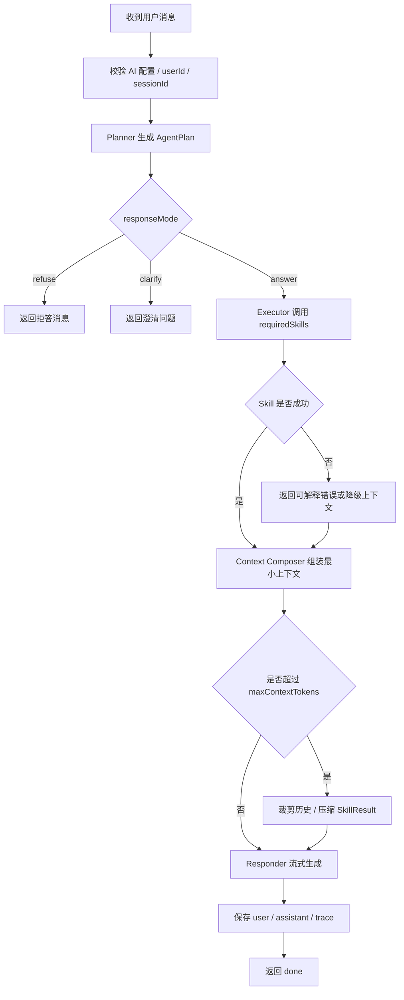
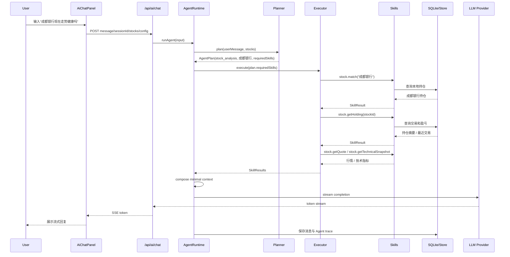

# StockTracker Agent Runtime 技术方案

## 1. 背景与目标

当前 AI 对话功能采用“用户问题 + 持仓上下文 + 历史消息”的方式直接请求模型。这个方案实现简单，但当用户持仓和交易记录持续增长后，会出现几个长期问题：

- 大量无关持仓占用上下文空间。
- 单次请求变慢，成本升高。
- 模型容易被不相关数据干扰，回答不够聚焦。
- 数据权限和调用链不够显式，后续开源后不利于审计和扩展。

Agent Runtime 的目标是把 AI 对话从“全量上下文聊天”升级为“按需调度数据的领域 Agent”：

```text
用户问题
  -> Agent Planner 识别意图、实体和所需数据
  -> Skill Registry 匹配可用技能
  -> Executor 按需读取本地数据或行情接口
  -> Context Composer 组装最小必要上下文
  -> Responder 流式生成回复
```

现有仓位管理、交易记录、行情抓取、技术指标和 AI 对话持久化能力，是 Agent 的数据底座和前置条件。Agent 则作为系统的“心脏”，负责理解用户问题、调度数据、组织分析和驱动后续工作流。

## 2. 设计原则

- **领域优先**：Agent 只服务股票、持仓、交易、风险、行情、估值和资产配置，不做通用助理。
- **按需取数**：默认不注入全量持仓，只有问题需要的数据才进入上下文。
- **规则优先，模型补充**：股票名称、代码、组合类问题优先用本地规则识别；规则不足时再使用 LLM Planner。
- **极简首版**：V1 只做单轮 `plan -> execute -> answer`，不做自主循环、长期记忆、自我生成 Skill 或子 Agent。
- **可解释可审计**：每次 Agent 运行都保留 plan、skill calls、context stats，方便调试和开源协作。
- **权限最小化**：Skill 只能读取被声明允许的数据范围；首版不开放 shell、文件写入和任意网络访问。
- **渐进扩展**：先做内置 Skill Registry，后续再演进到可安装 Skill、权限声明和社区生态。

## 3. 总体架构



## 4. 推荐代码结构

```text
lib/agent/
  runtime.ts
    Agent 主流程编排，负责 plan、execute、compose、respond。

  planner.ts
    意图识别、实体识别、数据需求规划。规则优先，LLM 兜底。

  executor.ts
    根据 AgentPlan 调用 Skill，并收集 SkillResult。

  context.ts
    将 AgentPlan、SkillResult、历史消息组装成最小模型上下文。

  responder.ts
    对接现有 OpenAI-compatible / Anthropic-compatible 流式回复逻辑。

  types.ts
    AgentIntent、AgentPlan、AgentSkill、AgentSkillResult 等核心类型。

  errors.ts
    Agent 错误类型，例如 ClarifyRequired、OutOfScope、SkillExecutionError。

lib/agent/skills/
  registry.ts
    内置 Skill 注册表。首版从 Markdown manifest 读取描述，再绑定受控执行器。

  loader.ts
    读取 `skills/builtin/*/SKILL.md`，解析 frontmatter、依赖、脚本绑定和正文说明。

  portfolio.ts
    组合级技能：组合摘要、风险结构、Top 持仓。

  stock.ts
    个股级技能：持仓、交易、行情、估值。

  market.ts
    市场级技能：大盘、候选标的、外部行情。

  technical.ts
    技术指标技能：K 线、均线、MACD、RSI、BOLL、ATR。

  history.ts
    对话历史技能：最近消息、未来的会话摘要。

lib/agent/entity/
  stockMatcher.ts
    股票名称、代码、拼音或别名匹配。

  marketResolver.ts
    市场歧义处理，例如同名标的、多市场候选。

app/api/ai/chat/route.ts
  从直接 buildChatContext 演进为调用 Agent Runtime。

skills/builtin/
  <skill-name>/SKILL.md
    Skill 的描述文档、权限声明、依赖声明、脚本绑定和使用说明。

docs/AGENT_ARCHITECTURE.md
  本文档。
```

## 5. 核心类型设计

```ts
export type AgentIntent =
  | 'stock_analysis'
  | 'portfolio_risk'
  | 'portfolio_summary'
  | 'trade_review'
  | 'market_question'
  | 'out_of_scope'
  | 'unknown'

export type AgentResponseMode = 'answer' | 'clarify' | 'refuse'

export type AgentEntity = {
  type: 'stock' | 'market' | 'portfolio'
  raw: string
  code?: string
  name?: string
  market?: Market
  confidence: number
}

export type AgentSkillCall = {
  name: string
  args: Record<string, unknown>
  reason: string
}

export type AgentPlan = {
  intent: AgentIntent
  entities: AgentEntity[]
  requiredSkills: AgentSkillCall[]
  responseMode: AgentResponseMode
  clarifyQuestion?: string
}

export type AgentExecutionContext = {
  userId: string
  sessionId: string
  stocks: Stock[]
  aiConfig: AiConfig
  maxContextTokens: number
}

export type AgentSkill<TArgs = unknown, TResult = unknown> = {
  name: string
  description: string
  inputSchema: unknown
  requiredScopes: AgentDataScope[]
  execute: (args: TArgs, ctx: AgentExecutionContext) => Promise<AgentSkillResult<TResult>>
}

export type AgentSkillResult<TResult = unknown> = {
  skillName: string
  ok: boolean
  data?: TResult
  error?: string
  tokenEstimate?: number
}
```

## 6. V1 Skill 列表

首版只提供内置 Skill，覆盖最常见的对话问题。每个 Skill 以目录包形式组织，`SKILL.md` 是技能描述源，执行逻辑通过受控 TypeScript 函数绑定。

```text
skills/builtin/stock-get-holding/
  SKILL.md
```

`SKILL.md` 使用 frontmatter 描述机器可读元信息，正文描述人类可读的使用场景和边界：

```md
---
name: stock.getHolding
description: 读取单只股票的本地持仓、成本、盈亏和备注。
version: 1
scopes:
  - stock.read
inputs:
  stockId: string
dependencies:
  - lib/finance.ts
script: lib/agent/skills/stock.ts#stockGetHoldingSkill
---

# 使用场景

当用户询问某只已持仓股票的走势、成本、盈亏、仓位、是否继续持有或风险时使用。
```

| Skill | 数据范围 | 用途 |
| --- | --- | --- |
| `portfolio.getSummary` | `portfolio.read` | 获取组合总成本、总盈亏、盈亏数量、仓位概览。 |
| `portfolio.getTopPositions` | `portfolio.read` | 获取最大仓位、最大盈利、最大亏损、近期活跃持仓。 |
| `stock.match` | `stock.read` | 根据用户输入匹配本地持仓中的股票名称或代码。 |
| `stock.getHolding` | `stock.read` | 获取单只股票持仓、成本、盈亏、备注。 |
| `stock.getRecentTrades` | `trade.read` | 获取单只股票最近交易记录。 |
| `stock.getQuote` | `quote.read` | 获取行情、涨跌幅、PE、PB、EPS、市值等。 |
| `stock.getTechnicalSnapshot` | `quote.read` | 获取 K 线衍生技术指标摘要。 |
| `market.resolveCandidate` | `quote.read` | 当用户只提供名称或代码且市场不明确时，返回候选项。 |

V1 不支持任意用户上传 Skill，不支持 shell，不支持文件写入，不支持无限制网络请求。`script` 字段只允许绑定仓库内受控执行器，不代表可以执行任意脚本。

## 7. Planner 设计

Planner 负责把自然语言问题转成结构化计划。

### 7.1 规则优先

优先使用本地确定性规则：

- 股票代码识别：`601838`、`00700`、`AAPL`。
- 本地持仓名称匹配：如“成都银行”命中持仓名称。
- 常见组合词识别：仓位、风险、亏损、盈利、复盘、分红、成本。
- 无关主题识别：天气、编程、娱乐、医疗、法律、通用百科。

### 7.2 LLM 兜底

当规则无法明确判断时，使用 LLM Planner 输出严格 JSON：

```json
{
  "intent": "stock_analysis",
  "entities": [
    {
      "type": "stock",
      "raw": "成都银行",
      "confidence": 0.92
    }
  ],
  "requiredSkills": [
    {
      "name": "stock.match",
      "args": { "query": "成都银行" },
      "reason": "用户询问单只股票，需要先匹配标的"
    }
  ],
  "responseMode": "answer"
}
```

### 7.3 歧义处理

如果标的不明确，Planner 不应猜测，应返回澄清计划：

```json
{
  "intent": "stock_analysis",
  "entities": [{ "type": "stock", "raw": "平安", "confidence": 0.5 }],
  "requiredSkills": [
    {
      "name": "market.resolveCandidate",
      "args": { "query": "平安" },
      "reason": "存在多只可能标的"
    }
  ],
  "responseMode": "clarify",
  "clarifyQuestion": "你想分析的是中国平安、平安银行，还是其他标的？"
}
```

## 8. 运行流程图



## 9. 时序图



## 10. Context Composer 策略

Context Composer 是控制上下文成本的核心。

### 10.1 单只股票问题

当用户只问“成都银行现在走势健康吗”：

- 注入系统提示词。
- 注入当前用户问题。
- 注入成都银行持仓摘要。
- 注入成都银行最近交易。
- 注入成都银行行情和技术指标。
- 注入最近少量对话历史。
- 不注入其他股票持仓。

### 10.2 组合风险问题

当用户问“我现在仓位风险大吗”：

- 注入组合总览。
- 注入 Top N 仓位。
- 注入最大浮盈、最大浮亏、近期活跃持仓。
- 必要时注入行业或市场分布，若系统已有该数据。
- 不注入每只股票完整交易记录。

### 10.3 未持仓股票问题

当用户问未持仓股票：

- 先尝试本地匹配。
- 匹配不到且市场不明确，则返回候选项让用户选择。
- 用户选择后再抓取行情和基础数据。
- 回复中明确说明“该标的不在当前持仓中”。

### 10.4 上下文上限

`maxContextTokens` 仍作为最终安全阈值：

- 优先裁剪历史消息。
- 再压缩 SkillResult。
- 最后才返回上下文过长错误。

## 11. 持久化与 Trace

现有 `ai_chat_sessions` 和 `ai_chat_messages` 继续保留。建议新增 Agent 运行记录：

```text
ai_agent_runs
  id
  session_id
  user_id
  message_id
  intent
  response_mode
  plan_json
  skill_calls_json
  skill_results_json
  context_stats_json
  error
  created_at
```

用途：

- 调试 Planner 是否识别正确。
- 复盘 Skill 调用是否过多或过少。
- 分析上下文成本。
- 开源后便于用户提交可复现问题。

默认不导出到 JSON 备份，除非未来用户明确开启诊断导出。

## 12. 数据权限模型

首版 Skill 使用白名单权限：

```ts
export type AgentDataScope =
  | 'portfolio.read'
  | 'stock.read'
  | 'trade.read'
  | 'quote.read'
  | 'chat.read'
```

默认拒绝：

- `filesystem.write`
- `shell.exec`
- `network.unrestricted`
- API Key 明文读取
- 与投资数据无关的本机文件或浏览器数据

后续如果开放社区 Skill，每个 Skill 必须声明 `requiredScopes`，安装和运行前都要校验。

## 13. API 演进方案

现有接口：

```text
POST /api/ai/chat
```

保持不变，内部实现从：

```text
buildChatContext -> streamChatCompletion
```

演进为：

```text
runAgent -> planner -> executor -> context composer -> responder
```

SSE 事件建议扩展：

```text
event: status
data: { "phase": "planning" }

event: status
data: { "phase": "reading-data", "skill": "stock.getHolding" }

event: meta
data: { "sessionId": "...", "stats": {...}, "plan": {...} }

event: token
data: { "token": "..." }

event: done
data: { "sessionId": "...", "runId": "..." }
```

UI 首版可以只展示轻量 loading，不必把所有 Skill 过程暴露给普通用户；调试模式再展示 trace。

## 14. 与现有实现的关系

现有模块可以复用：

- `lib/finance.ts`：FIFO、成本、盈亏计算。
- `store/useStockStore.ts`：当前用户持仓和配置。
- `lib/sqlite/db.ts`：本地持久化。
- `lib/StockPriceService.ts`：行情统一入口。
- `lib/technicalIndicators.ts`：技术指标。
- `lib/ai/config.ts`：`.env.local` 与设置页配置合并。
- `lib/ai/chat.ts`：可拆分复用流式 completion、token 估算、系统提示词。

需要重构：

- 当前 `buildChatContext` 不再默认构建全量 holdings。
- AI 对话 route 需要切换到 Agent Runtime。
- Skill 结果需要有统一结构和可估算 token 成本。

## 15. 路线图

### V1：极简 Agent

- 单轮 `plan -> execute -> answer`。
- 内置 Skill Registry。
- 按需获取本地持仓和行情数据。
- Agent trace 持久化。
- 不开放第三方 Skill。

### V2：多步 Agent

- 最多 2-3 轮工具调用。
- 支持“先匹配标的，再发现缺行情，再抓取行情”的链式执行。
- 更完善的澄清机制。

### V3：会话摘要与用户偏好

- 长对话自动摘要。
- 记录用户投资偏好，例如偏股息、偏短线、偏低波动。
- 支持投资纪律提醒。

### V4：开放 Skill

- Skill manifest。
- 权限声明。
- 社区 Skill 白名单。
- 安全审计工具。
- 可选 `scripts/`、`templates/`、`references/` 目录，但必须经过权限校验和沙箱策略。

### V5：工作流 Agent

- 每日复盘。
- 持仓异动提醒。
- 财报、分红、技术破位提醒。
- 自然语言配置定时任务。

## 16. 开源设计注意事项

- 文档优先：Agent 行为、权限、Skill 接口都要有正式文档。
- 默认安全：新安装项目不应允许任意代码执行。
- 可测试：Planner 规则、Skill 输入输出、Context Composer 都应有单元测试。
- 可观测：Agent trace 要能帮助用户定位“为什么调用了这个 Skill”。
- 可替换模型：继续支持 OpenAI-compatible 和 Anthropic-compatible，不绑定单一厂商。
- 本地优先：用户持仓和对话默认保存在本地 SQLite。

## 17. 首版开发拆分建议

1. 新增 `lib/agent/types.ts`、`runtime.ts`、`planner.ts`、`executor.ts`、`context.ts`。
2. 新增内置 Skill Registry 和首批 portfolio / stock Skill。
3. 将 `/api/ai/chat` 内部切换到 Agent Runtime。
4. 新增 `ai_agent_runs` 表，保存 plan 和 skill trace。
5. 补充 Planner、Skill、Context Composer 单元测试。
6. 用以下场景手动验证：
   - “成都银行现在走势健康吗”
   - “我现在组合最大的风险是什么”
   - “最近哪只股票亏得最多”
   - “腾讯现在能不能关注”
   - “今天天气怎么样”
